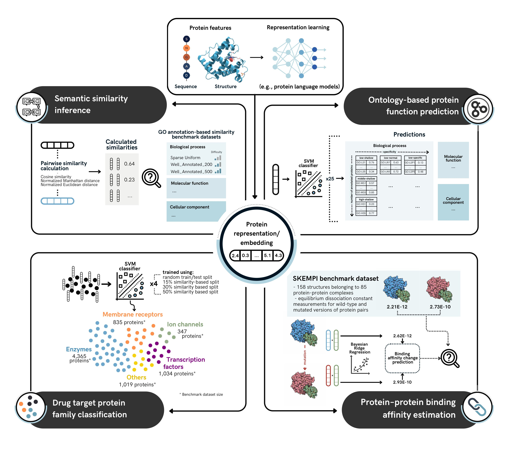

# PROBE: Protein RepresentatiOn BEnchmark

**Function-centric evaluation of protein representation models**



---

## Overview

**PROBE** evaluates fixed-length protein embeddings for how well they capture *functional* biological knowledge. It provides **four complementary benchmarks**:

| Benchmark | Biological Question | Key Metric(s) | Dataset & Split |
|-----------|---------------------|----------------|------------------|
| **Semantic Similarity Inference** | Do embeddings place functionally similar proteins closer together? | Spearman ρ (embedding distance vs Resnik GO similarity) | 500, 200, Sparse protein sets |
| **GO-Term Function Prediction** | Can GO terms be predicted from embeddings? | F-max, AUROC, AUPR (5-fold CV) | Swiss-Prot Human; splits by size (High / Middle / Low); MF, BP, CC |
| **Drug-Target Family Classification** | Can embeddings classify proteins into drug-target families? | MCC, Accuracy, Macro-F1 (10-fold CV) | Random and identity-based splits (nc, uc50, uc30, mm15) |
| **Protein–Protein Binding Affinity** | Can embeddings predict ΔΔG of interface mutants? | MSE, MAE, Pearson R (10-fold CV) | SKEMPI v1 (3,047 mutants) |

Introduced in **Unsal *et al.* 2022**, [DOI: 10.1038/s42256-022-00457-9](https://doi.org/10.1038/s42256-022-00457-9)

---

## 🔧 Getting Started

### Option 1: Use the Web Server (Recommended)

Run benchmarks directly in the browser:

▶️ **HuggingFace Spaces:**  
<https://huggingface.co/spaces/HUBioDataLab/PROBE>

Upload your embedding vectors, select tasks, and get results. Interactive leaderboards and plots are available.

Described in **Çevrim *et al.* 2025**, [DOI: 10.1101/2025.04.10.648084](https://doi.org/10.1101/2025.04.10.648084)

---

### Option 2: Run Locally

#### System Requirements

- **OS:** Ubuntu 20.04 or compatible
- **Python:** ≥ 3.9
- **RAM:** 8 GB minimum (16 GB+ recommended)

#### Installation

```bash
# Clone repository
git clone https://github.com/HUBioDataLab/PROBE.git
cd PROBE

# (Optional) Set up virtual environment
python -m venv .venv
source .venv/bin/activate

# Install dependencies
pip install -r requirements.txt
```

---

### Setup Files

#### 1. Download Benchmark Datasets

```bash
mkdir -p data
curl -L -o datasets.zip \
  https://drive.google.com/uc?export=download&id=1elGfjI4jwzcjOBT6LoMnz-7DtdwPFV6i
unzip datasets.zip -d data
```

Creates:

- `data/auxilary_input/`
- `data/preprocess/`

---

#### 2. Obtain Representation Vectors

Choose one:

- **Use Preprocessed Embeddings**
  - [HUMAN embeddings](https://drive.google.com/drive/folders/1WmYyaBhOYtI4Hzbsg2sTQHRN6LVrYFhw) – for similarity, function, and family benchmarks
  - [SKEMPI embeddings](https://drive.google.com/drive/folders/18sVmR0Xx_QfmjeqCPxz3gS5DS09FqS_T) – for affinity benchmark

- **Or Prepare Your Own Embeddings**  
  See [Preparing new embedding files](#-preparing-new-embedding-files)

> Place all embeddings under:  
> `data/representation_vectors/`

---

#### 3. Configure Benchmark Run

Edit the `probe_config.yaml`:

```yaml
representation_name: MyModel         # prefix for output files

benchmark: all                       # similarity | function | family | affinity | all

representation_file_human: ../data/representation_vectors/mymodel_uniprot_human.csv
representation_file_affinity: ../data/representation_vectors/mymodel_skempi.csv

similarity_tasks: ["Sparse", "200", "500"]
function_prediction_aspect: All_Aspects
function_prediction_dataset: All_Data_Sets
family_prediction_dataset: ["nc", "uc50", "uc30", "mm15"]

detailed_output: False
```

Set `detailed_output: True` to additionally save pickled models, raw predictions, confusion matrices, and per‑fold score arrays.

---

#### 4. Run the Benchmark

```bash
cd bin
python PROBE.py
```

Results will be saved in the `results/` folder.

---

## Preparing New Embedding Files

1. **Generate Embeddings** for:
   - Swiss‑Prot human canonical proteins  
     [FASTA](https://drive.google.com/uc?export=download&id=1wXF2lmj4ZTahMrl66QpYM2TvHmbcIL6b)
   - SKEMPI v1 complexes  
     [FASTA](https://drive.google.com/uc?export=download&id=1m5jssC0RMsiFT_w-Ykh629Pw_An3PInI)

2. **Format as CSV**:
   * Column 0 header **`Entry`** (UniProt accession or SKEMPI ID)  
   * Remaining columns: integer feature indices (`0,1,2,…`)  
   * One row per sequence; all rows have equal vector length

3. **Save to**: `data/representation_vectors/`  
   Reference the file paths in `probe_config.yaml`.

---

## Output Files

| Benchmark | Filename Pattern | Contents |
|-----------|------------------|----------|
| Semantic Similarity | `Semantic_sim_inference_<matrix>_<rep>.csv` | Spearman correlations for 500, 200, Sparse |
| Function Prediction | `Ontology_based_function_prediction_5cv_mean_<rep>.tsv`<br>`..._std_<rep>.tsv` | Mean ± SD of F-max, AUROC, AUPR |
| Family Classification | `Drug_target_protein_family_classification_mean_results_<split>_<rep>.csv`<br>`..._class_based_results_...csv` | Overall + per-family metrics |
| Binding Affinity | `Affinit_prediction_skempiv1_<rep>.csv`<br>`..._detail.csv` | MSE, MAE, Pearson R, per fold |

---

## Acknowledgements

- Benchmark: **Süleyman Unsal, Hakan Atas, Mehmet Albayrak, Kadir Turhan, Ahmet Cem Acar, Tunca Doğan**
- Web Platform: **Elif Çevrim, Melih Gökay Yiğit, Erva Ulusoy, Ardan Yılmaz, Tunca Doğan**

---

## License

Released under the **GNU General Public License v3.0**

---

## Citation

> **Unsal S.**, *et al.* (2022).  
> *Learning functional properties of proteins with language models.*  
> *Nature Machine Intelligence*, 4, 227–245.  
> [DOI: 10.1038/s42256-022-00457-9](https://doi.org/10.1038/s42256-022-00457-9)

> **Çevrim E.**, *et al.* (2025).  
> *A Benchmarking Platform for Assessing Protein Language Models on Function-Related Tasks.*  
> *bioRxiv*  
> [DOI: 10.1101/2025.04.10.648084](https://doi.org/10.1101/2025.04.10.648084)
